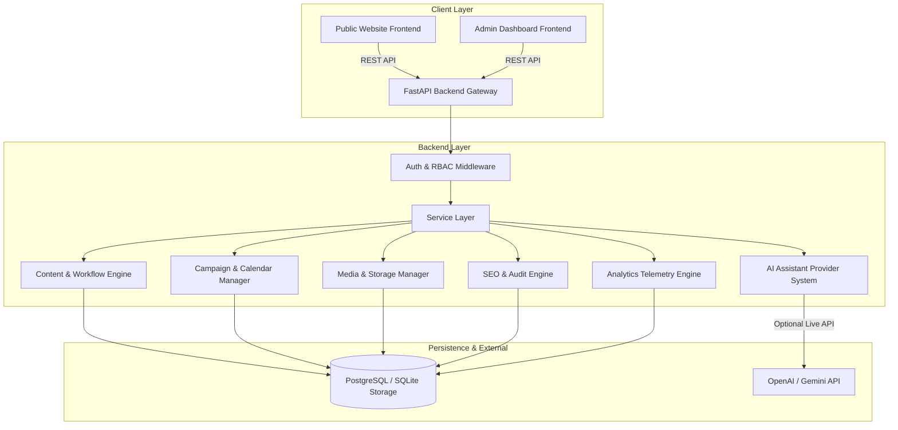
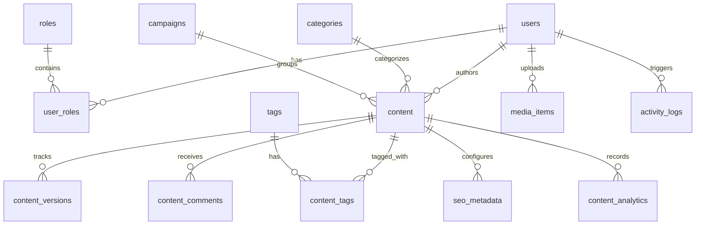

# KALAM — AI-Powered Marketing Content Management Platform

An enterprise-grade, full-stack Marketing Content Management System (CMS) featuring multi-role authentication, structured content workflow approval governance, versioning & audit logs, campaign management, interactive content calendar, media asset library, automated SEO health analysis, mock/live AI writing assistant, telemetry analytics dashboard, and a public-facing marketing portal.

---

## 🏗 System Architecture Overview

The system is built as a decoupled, multi-tiered application:



---

## 🛠 Tech Stack

### Frontend
- **Framework**: React 18 with TypeScript
- **Build System**: Vite 5
- **UI Library**: Material UI (MUI v5) & MUI Icons
- **State & Routing**: React Router v6
- **Forms & Validation**: React Hook Form, Zod
- **Charts & Telemetry**: Recharts
- **HTTP Client**: Axios with Bearer Auth Interceptors

### Backend
- **Framework**: Python 3.10+, FastAPI
- **Validation & Schemas**: Pydantic v2
- **ORM & Database**: SQLAlchemy 2.0
- **Database Migrations**: Alembic
- **Security & Auth**: OAuth2 with Password Flow, JWT (HS256), Passlib (Bcrypt)

### Database
- **Primary RDBMS**: PostgreSQL (SQLite supported for rapid zero-dependency local development/testing)

---

## 📊 Database Schema & Entities



### Core Data Models
1. **Users & Roles**: `users`, `roles`, `permissions`, `user_roles`
2. **Content Management**: `content`, `categories`, `tags`, `content_tags`
3. **Governance & Audit**: `content_versions`, `content_comments`, `activity_logs`
4. **Campaigns & Planning**: `campaigns`
5. **Media Assets**: `media_items`
6. **SEO & Optimization**: `seo_metadata`
7. **Telemetry & Analytics**: `content_analytics`, `daily_analytics`

---

## 🔑 Role-Based Access Control (RBAC) Matrix

| Action / Capability | Admin | Marketing Manager | Content Editor | Content Author | Reviewer |
| :--- | :---: | :---: | :---: | :---: | :---: |
| **Manage Users & System** | ✅ | ❌ | ❌ | ❌ | ❌ |
| **Create Draft Content** | ✅ | ✅ | ✅ | ✅ | ❌ |
| **Edit Draft / Request Fixes** | ✅ | ✅ | ✅ | ✅ | ❌ |
| **Submit Content for Review** | ✅ | ✅ | ✅ | ✅ | ❌ |
| **Approve / Reject Content** | ✅ | ✅ | ❌ | ❌ | ✅ |
| **Schedule Content** | ✅ | ✅ | ❌ | ❌ | ❌ |
| **Publish Content** | ✅ | ✅ | ❌ | ❌ | ❌ |
| **Manage Campaigns** | ✅ | ✅ | ❌ | ❌ | ❌ |
| **Upload Media Assets** | ✅ | ✅ | ✅ | ✅ | ✅ |
| **View Analytics & SEO** | ✅ | ✅ | ✅ | ✅ | ✅ |

---

## 🚀 Key Features

### 1. Enterprise Multi-Role Authentication & Security
- Role-Based Access Control (RBAC) with 5 granular roles.
- OAuth2 Password Bearer authentication with JWT expiration and verification.
- Bcrypt salted password hashing.

### 2. Multi-Format Content Management
- Supports 7 content types: **Blog Post**, **Landing Page**, **Email**, **Social Media Post**, **Advertisement**, **Case Study**, **Announcement**.
- Full CRUD operations with rich category and tag management.
- Dynamic filtering, multi-column sorting, search, and pagination.

### 3. Enterprise Content Approval Workflow
- Strict state transition governance:
  `Draft` ➔ `In Review` ➔ `Approved` / `Changes Requested` ➔ `Scheduled` ➔ `Published` ➔ `Archived`.
- State-aware UI action buttons dynamically rendered based on user role and current content state.
- Automated change requested comments and reviewer feedback tracking.

### 4. Version Control & Audit Trail
- Immutable content snapshot version history (`content_versions`).
- Automated diff detection between versions with one-click restore capabilities.
- System-wide activity timeline tracking state changes, edits, and reviewer actions.

### 5. Marketing Campaigns & Visual Calendar
- End-to-end campaign lifecycle tracking (Planning, Active, Paused, Completed).
- Association of multiple content items with budgets, target audiences, and performance goals.
- Full Month and Week calendar views with content status badges and direct navigation.

### 6. Digital Asset & Media Management
- Support for images (PNG, JPEG, GIF, WebP), videos (MP4, WebM), and documents (PDF, DOCX).
- Switchable Grid and List views with asset type filters, search, file size caps, and preview modal.

### 7. Automated SEO Audit Health Engine
- Quantitative SEO health score computation (0 - 100%).
- Real-time linting checks for title length, meta description quality, keyword density, URL slug structure, heading hierarchy, and image alt text presence.
- Actionable improvement recommendations.

### 8. AI Writing & Optimization Assistant
- 10 practical AI utilities:
  1. Headline Generation
  2. Meta Description Creation
  3. Content Rewriting
  4. Tone Modification (*Professional, Friendly, Persuasive, Informative, Concise*)
  5. Summarization
  6. Social Media Caption Generation
  7. Keyword Extraction
  8. Content Outline Generation
  9. Call-To-Action (CTA) Suggestions
  10. Readability Analysis
- Interactive drawer UI featuring **Accept**, **Edit**, or **Discard** options (AI never publishes without human consent).
- Pluggable backend architecture supporting both deterministic offline Mock mode and live LLM integration.

### 9. Analytics Telemetry Dashboard
- Comprehensive metrics tracking: Views, Engagement Rate, Click-Through Rate (CTR), Shares, Conversions, and Average Reading Time.
- Interactive performance charts (Recharts) filterable by date range, campaign, content type, author, and category.

### 10. Public Marketing Portal Integration
- Fully decoupled, modern public web application rendering published CMS content in real-time.
- Features Hero section, Featured & Recent Articles, Campaign Landing Pages, Blog Details, and Contact Page.

---

## ⚡ Quick Start & Setup Guide

### Prerequisites
- **Python**: 3.10 or higher
- **Node.js**: v18 or higher
- **Package Managers**: `pip` and `npm`

---

### Backend Setup

1. **Navigate to the backend directory**:
   ```bash
   cd backend
   ```

2. **Create and activate a virtual environment**:
   ```bash
   # Windows
   python -m venv venv
   venv\Scripts\activate

   # macOS / Linux
   python3 -m venv venv
   source venv/bin/activate
   ```

3. **Install dependencies**:
   ```bash
   pip install -r requirements.txt
   ```

4. **Environment Configuration**:
   Create a `.env` file inside `backend/`:
   ```env
   DATABASE_URL=sqlite:///./marketing_cms_dev.db
   SECRET_KEY=supersecretjwtkeyforenterpriseaimarketingcms2026
   ALGORITHM=HS256
   ACCESS_TOKEN_EXPIRE_MINUTES=1440
   OPENAI_API_KEY=mock-key-ai-assistant
   USE_MOCK_AI=true
   ```

5. **Run Database Migrations & Seed Data**:
   ```bash
   alembic upgrade head
   python seed.py
   ```

6. **Start FastAPI Backend Server**:
   ```bash
   uvicorn app.main:app --reload --port 8000
   ```
   The backend API documentation will be accessible at:
   - Interactive Swagger Docs: `http://localhost:8000/docs`
   - ReDoc: `http://localhost:8000/redoc`

---

### Frontend Setup

1. **Navigate to the frontend directory**:
   ```bash
   cd frontend
   ```

2. **Install dependencies**:
   ```bash
   npm install
   ```

3. **Start Vite Development Server**:
   ```bash
   npm run dev
   ```
   The application will be running at `http://localhost:5173`.

---

## 👥 Seed Demo Credentials

| Role | Email | Password | Primary Capabilities |
| :--- | :--- | :--- | :--- |
| **Admin** | `admin@enterprise.com` | `Admin123!` | Full system control, user management, publishing |
| **Marketing Manager** | `manager@enterprise.com` | `Manager123!` | Campaign control, approvals, scheduling, publishing |
| **Content Editor** | `editor@enterprise.com` | `Editor123!` | Draft creation, copy editing, submitting for review |
| **Content Author** | `author@enterprise.com` | `Author123!` | Content creation, AI assistance, version management |
| **Reviewer** | `reviewer@enterprise.com` | `Reviewer123!` | Peer review, approving content, requesting changes |

---

## 🧪 Automated Testing

### Backend Unit & Integration Tests
The backend includes test coverage for authentication, RBAC permissions, content CRUD, workflow transitions, versioning, SEO audit, AI providers, and full end-to-end user journeys.

Run tests using pytest:
```bash
cd backend
venv\Scripts\python -m pytest -v tests
```

Expected output:
```text
tests/test_auth.py ........                                           [ 40%]
tests/test_content.py .......                                         [ 75%]
tests/test_e2e_workflow.py .....                                      [100%]
============================== 20 passed in 4.12s ==============================
```

### Frontend Build Verification
Verify production bundle compilation:
```bash
cd frontend
npm run build
```

---

## 🔌 API Endpoints Summary

### Authentication (`/api/auth`)
- `POST /api/auth/register` - Register new user account
- `POST /api/auth/login` - Authenticate and receive JWT access token
- `GET /api/auth/me` - Get current authenticated user profile
- `POST /api/auth/change-password` - Update account password

### Content Management (`/api/content`)
- `GET /api/content` - List content with filtering, sorting, and pagination
- `POST /api/content` - Create new content draft
- `GET /api/content/{id}` - Fetch content item details
- `PUT /api/content/{id}` - Update content item
- `DELETE /api/content/{id}` - Delete content item
- `POST /api/content/{id}/submit-review` - Submit draft for review
- `POST /api/content/{id}/approve` - Approve submitted content
- `POST /api/content/{id}/request-changes` - Request revisions with comments
- `POST /api/content/{id}/schedule` - Schedule content publication date
- `POST /api/content/{id}/publish` - Publish content item
- `POST /api/content/{id}/archive` - Archive content item

### Versioning & Comments (`/api/content/{id}/...`)
- `GET /api/content/{id}/versions` - Get version history
- `POST /api/content/{id}/restore/{version_id}` - Restore content to specific version
- `GET /api/content/{id}/comments` - Fetch reviewer discussion thread
- `POST /api/content/{id}/comments` - Post comment on content item

### Campaigns (`/api/campaigns`)
- `GET /api/campaigns` - List marketing campaigns
- `POST /api/campaigns` - Create new campaign
- `GET /api/campaigns/{id}` - Get campaign metrics and content breakdown

### Media Library (`/api/media`)
- `GET /api/media` - List media assets
- `POST /api/media/upload` - Upload image, video, or document
- `DELETE /api/media/{id}` - Delete media asset

### AI Assistant (`/api/ai`)
- `POST /api/ai/generate` - Trigger AI assistant feature (Headlines, Rewrite, SEO, Social, etc.)

### SEO Audit (`/api/seo`)
- `POST /api/seo/analyze` - Run SEO audit linting on content payload

### Public Portal (`/api/public`)
- `GET /api/public/content` - Fetch published content for public website
- `GET /api/public/content/{slug}` - Fetch published content by slug

---

## 🎨 Architectural & Design Highlights

1. **Decoupled AI Engine**: Built around the Strategy pattern. When `USE_MOCK_AI=true`, the platform returns high-quality deterministic responses without incurring API costs. Setting `USE_MOCK_AI=false` seamlessly switches to live OpenAI/Gemini endpoints.
2. **Human-in-the-Loop AI Governance**: AI suggestions are presented in dedicated review panels. Authors must explicitly accept, modify, or discard suggestions, preventing unauthorized auto-publishing.
3. **Extensible RBAC System**: Database-driven roles and permissions combined with FastAPI dependency injection ensure strict enforcement at both backend API boundary and frontend UI component levels.
4. **State-Driven Workflow Engine**: Content state transitions are validated by explicit business logic rules, ensuring invalid transitions (e.g. `Draft` ➔ `Published` without approval) are blocked.

---

## 💼 Portfolio Presentation & Screenshots Guide

When presenting this project in a portfolio or demonstration:
1. **Dashboard & Governance**: Showcase the transition from Author submitting a draft to Reviewer approving and Marketing Manager publishing.
2. **AI Assistant Panel**: Demonstrate live headline generation, tone adjustment, and accepting suggestions into the active draft.
3. **Visual Content Calendar**: Highlight monthly and weekly views of scheduled cross-channel campaigns.
4. **SEO Audit Engine**: Show real-time scoring updates as meta descriptions and heading structures are optimized.
5. **Public Marketing Site vs Admin Workspace**: Emphasize the distinct branding and styling of the public portal consuming live CMS content.

---

## 📄 License
This project is released under the MIT License.
